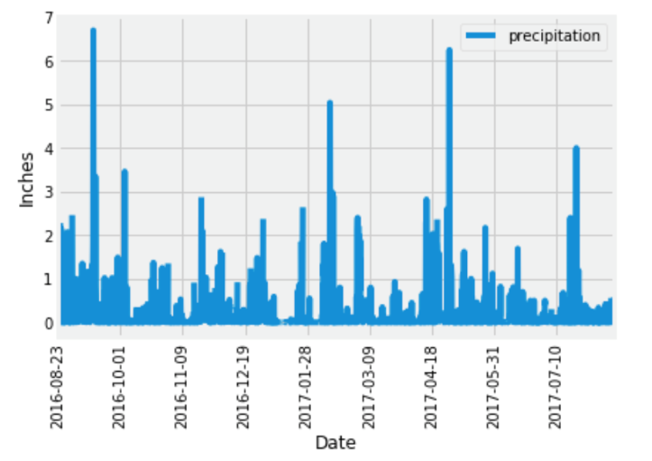
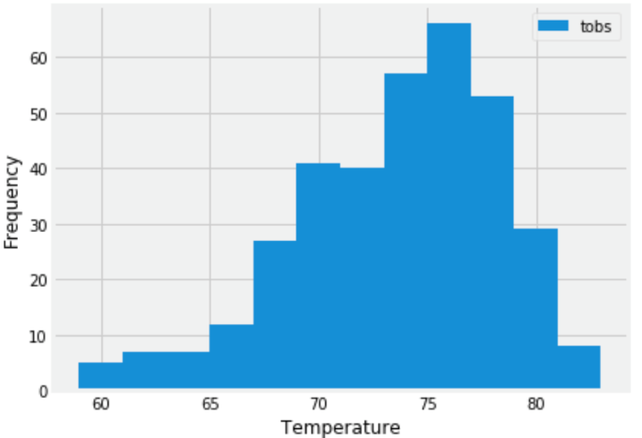
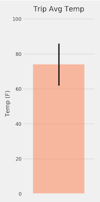

# SQLAlchemy - Planning for Vacation!

    

In this project I was challenged with planning for a ficticious holiday vacation in Honolulu, Hawaii! The requirement was to do climate analysis on the area. The following outlines what was done.

## Step 1 - Climate Analysis and Exploration

Python and SQLAlchemy was used to do basic climate analysis and data exploration of a providded climate database. All of the following analysis was completed using SQLAlchemy ORM queries, Pandas, and Matplotlib.

* A start date and end date was chosen for the trip. The planned vacation was for approximately one week

* Used SQLAlchemy `create_engine` to connect to sqlite database.

* Used SQLAlchemy `automap_base()` to reflect tables into classes and save a reference to those classes called `Station` and `Measurement`.

### Precipitation Analysis

* Designed a query to retrieve the last 12 months of precipitation data from the provided data set.

* Selected only the `date` and `prcp` values.

* Loaded the query results into a Pandas DataFrame and set the index to the date column.

* Sorted the DataFrame values by `date`.

* Plotted the results using the DataFrame `plot` method.

  

* Used Pandas to print the summary statistics for the precipitation data.

### Station Analysis

* Designed a query to calculate the total number of stations.

* Designed a query to find the most active stations.

  * Listed the stations and observation counts in descending order.

* Designed a query to retrieve the last 12 months of temperature observation data (TOBS).

  * Filtered by the station with the highest number of observations.

  * Plotted the results as a histogram with `bins=12`.

    

- - -

## Step 2 - Climate App

Designed a Flask API based on the queries that you have just developed.

* Used Flask to create routes.

### Routes

* `/`

  * Home page.

  * List all routes that are available.

* `/api/v1.0/precipitation`

  * Convert the query results to a dictionary using `date` as the key and `prcp` as the value.

  * Return the JSON representation of your dictionary.

* `/api/v1.0/stations`

  * Return a JSON list of stations from the dataset.

* `/api/v1.0/tobs`
  * Query the dates and temperature observations of the most active station for the last year of data.
  
  * Return a JSON list of temperature observations (TOBS) for the previous year.

* `/api/v1.0/<start>` and `/api/v1.0/<start>/<end>`

  * Return a JSON list of the minimum temperature, the average temperature, and the max temperature for a given start or start-end range.

  * When given the start only, calculate `TMIN`, `TAVG`, and `TMAX` for all dates greater than and equal to the start date.

  * When given the start and the end date, calculate the `TMIN`, `TAVG`, and `TMAX` for dates between the start and end date inclusive.

* Joined the station and measurement tables for some of the queries.

* Used Flask `jsonify` to convert API data into a valid JSON response object.

- - -

## Additional Analyses

### Temperature Analysis

* Used a `calc_temps` function to calculate the min, avg, and max temperatures for the trip using the matching dates from the most recent previous year (i.e., use "2017-01-01" if trip start date was "2018-01-01").

* Plotted the min, avg, and max temperature from previous query as a bar chart.

  * Used the average temperature as the bar height.

  * Used the peak-to-peak (TMAX-TMIN) value as the y error bar (YERR).

    

### Daily Rainfall Average

* Calculated the rainfall per weather station using the most recent year's matching dates.

* Calculated the daily normals. 

* Created a list of dates for the trip in the format `%m-%d`. Used a`daily_normals` function to calculate the normals for each date string and appended the results to a list.

* Loaded the list of daily normals into a Pandas DataFrame and set the index equal to the date.

* Used Pandas to plot an area plot (`stacked=False`) for the daily normals.

  

